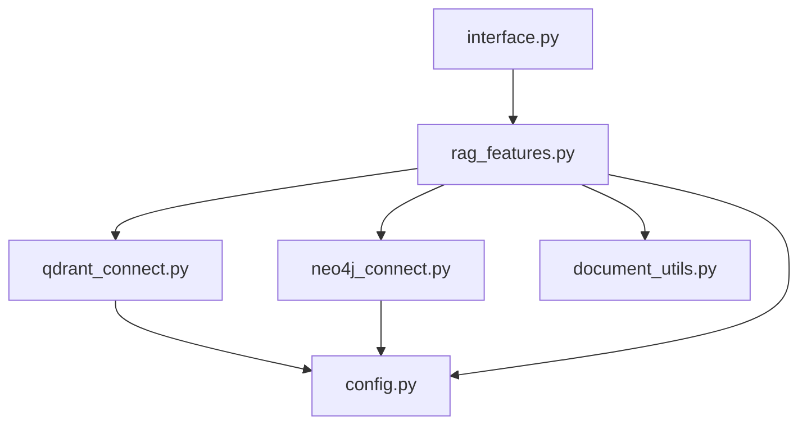

# BluePrint: Architecture GreenPower RAG

Ce document sert de référence technique pour la maintenance, l'extension et la compréhension du code actuel. Il définit les responsabilités de chaque module et impose des contraintes pour les développements futurs.

## 1. Architecture Globale

Le projet suit une architecture **modulaire** où chaque fichier a une responsabilité unique.



## 2. Spécifications Technique des Modules

Cette section détaille les fonctions clés, en particulier celles dont la logique interne est complexe ou non-immédiate.

### 🧠 `rag_features.py` (Cerveau du système)
Gère la logique de RAG Hybride et le routage des questions.

*   `HybridRetriever.__init__(use_neo4j=False)`:
    *   Initialise les connexions.
    *   **Contrainte**: Si `use_neo4j=True`, la classe tente d'initialiser `GraphRAG`. Si la connexion échoue, elle doit gérer l'erreur silencieusement ou passer en mode dégradé, mais ne pas crasher l'app.
    
*   `route_query(query: str) -> str`:
    *   **Logique**: Analyse la question par mots-clés (Regex) pour décider de la stratégie : `'qdrant'` (factuel/prix), `'neo4j'` (relationnel/historique) ou `'hybrid'` (tout le reste).
    *   **Pourquoi**: Évite d'interroger le graphe (couteux) pour des questions simples comme "Quel est le prix ?".

*   `retrieve(query: str) -> Tuple`:
    *   Dispatche la requête vers les connecteurs appropriés selon le résultat de `route_query`.
    *   Retourne une liste de "chunks" (documents vectoriels + contexte graphe simulé en document).

### 🕸️ `neo4j_connect.py` (Graphe de Connaissances)
Gère l'interaction avec Neo4j et l'extraction d'entités via LLM.

*   `GraphRAG.extract_entities_and_relations(text: str)`:
    *   Utilise un **Prompt LLM** spécialisé pour transformer du texte brut en JSON structuré.
    *   **Contrainte**: Doit toujours nettoyer la sortie du LLM (suppression des balises markdown ```json) avant le parsing.
    
*   `GraphRAG.build_graph(documents)`:
    *   Itère sur les documents, extrait les entités pour chacun, et les insère dans Neo4j.
    *   **Attention**: Maintient une map `entity_id_map` locale pour éviter les duplications *pendant l'exécution*, mais ne vérifie pas encore l'existence en base au démarrage (risque de doublons si relancé plusieurs fois sans nettoyage).

*   `GraphRAG.query_graph(question)`:
    *   **Non-vectoriel**: N'utilise pas d'embeddings de graphe.
    *   **Logique**: Extrait les mots-clés de la question -> Trouve les nœuds correspondants (index fulltext ou contains) -> Récupère les voisins immédiats (profondeur 1).
    *   Retourne une représentation textuelle du sous-graphe trouvé.

### 💾 `qdrant_connect.py` (Base Vectorielle)
Wrapper pour Qdrant.

*   `_connect()`:
    *   **Feature**: Tente une connexion Cloud (si clés présentes) et fallback automatiquement sur une base locale (`:memory:`) si échec ou absence de clés. Permet de développer sans internet/clés.

### 📄 `document_utils.py` (ETL)
Chargeurs de fichiers.

*   `load_document(file_path)`:
    *   **Factory pattern simple**: Sélectionne le bon loader (`PyPDFLoader`, `TextLoader`, etc.) selon l'extension du fichier.
    *   **Contrainte**: Doit retourner une `List[Document]` compatible LangChain, quel que soit le format d'entrée.

## 3. Contraintes de Développement

Pour tout ajout de fonctionnalité, respectez ces règles :

1.  **Configuration Centralisée** :
    *   🚫 **Interdit** de mettre des `os.getenv()` ou des clés en dur dans les modules.
    *   ✅ Toujours importer depuis `config.py`.

2.  **Gestion des Erreurs Silencieuse** :
    *   Les connecteurs (`_connect()`) ne doivent pas lever d'exception bloquante. Ils doivent imprimer un warning (⚠️) et si possible fournir une instance de fallback (ex: Qdrant en mémoire, ou désactiver Neo4j).

3.  **Typage** :
    *   Utiliser les type hints (`List`, `Dict`, `Optional`) pour toutes les signatures de fonction.

4.  **Dépendances** :
    *   Si un module a besoin d'une nouvelle librairie, l'ajouter immédiatement à `requirements.txt`.

## 4. Template de Nouveau Module

Utilisez ce script boilerplate pour créer un nouveau module "Service" (ex: `web_search.py`, `sql_connect.py`).

```python
# new_module_template.py
import logging
from typing import Dict, Any, Optional
from config import MY_NEW_API_KEY  # Toujours importer la config

# Configurer un logger spécifique au module
logger = logging.getLogger(__name__)

class MyServiceConnector:
    """
    Description claire du rôle de ce module.
    Ex: Gère la connexion à l'API de recherche Web.
    """
    
    def __init__(self):
        self.is_active = False
        self._connect()
        
    def _connect(self):
        """
        Logique de connexion sécurisée.
        Ne doit pas crasher l'app si le service est indisponible.
        """
        if not MY_NEW_API_KEY:
            logger.warning("⚠️ API Key manquante. Service désactivé.")
            return

        try:
            # Tenter la connexion ici
            # self.client = ...
            self.is_active = True
            print("✅ Service connecté")
        except Exception as e:
            logger.error(f"❌ Erreur de connexion: {e}")
            self.is_active = False

    def execute_task(self, input_data: str) -> Dict[str, Any]:
        """
        Fonction principale du module.
        Le nom doit être explicite (ex: search, fetch, compute).
        """
        if not self.is_active:
            return {"error": "Service inactive"}
            
        # Logique métier interne complexe/non-explicite
        # Expliciter ici ce que fait le traitement
        result = self._internal_processing(input_data)
        return result

    def _internal_processing(self, data: str) -> str:
        """
        Méthode privée pour la logique 'cuisine interne' qui n'a pas besoin
        d'être exposée.
        """
        return data.upper() # Placeholder
```
