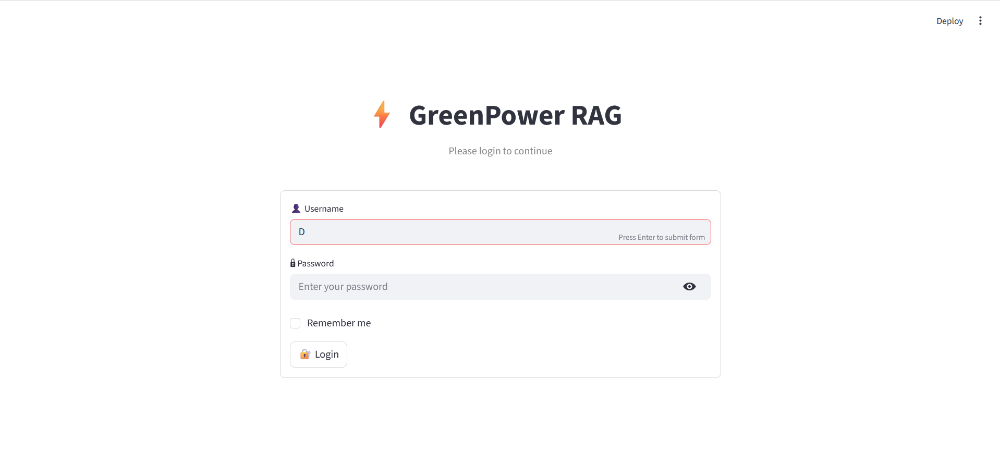
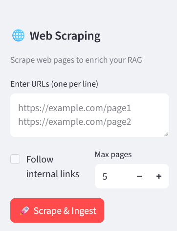
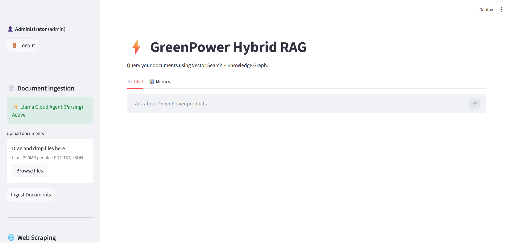

# GreenPower RAG

A Hybrid RAG (Retrieval-Augmented Generation) system using Vector Search (Qdrant) and Knowledge Graph (Neo4J).

## 🚀 Quick Start

### 1. Install Dependencies

```bash
# Create virtual environment
python -m venv .venv

# Activate (Windows)
.\.venv\Scripts\activate

# Install dependencies
pip install -r requirements.txt
```

### 2. Configure Environment

Copy `.env.example` to `.env` and fill in your API keys:

```env
GROQ_API_KEY=your_groq_api_key
QDRANT_URL=your_qdrant_cloud_url
QDRANT_API_KEY=your_qdrant_api_key
NEO4J_URI=neo4j+s://your_instance.databases.neo4j.io
NEO4J_USER=neo4j
NEO4J_PASSWORD=your_neo4j_password
LLAMA_CLOUD_API_KEY=your_llama_cloud_key  # Optional
```

### 3. Run the Application

```bash
streamlit run interface.py
```

The application will be available at `http://localhost:8501`

---

## 🔐 Authentication

The application requires authentication to access.




### Default Credentials

| Username | Password | Role |
|----------|----------|------|
| `admin` | `admin123` | Administrator |

> ⚠️ **Important**: Change the default password after first login!

### Managing Users

Users are stored locally in `users.json`. The admin account can:
- Create new users
- Delete users (except admin)
- Change passwords

To manually add a user, edit `users.json` or use the Python API:

```python
from auth import create_user

create_user("newuser", "password123", role="user", display_name="New User")
```

---

## 📁 Project Structure

```
RAG_App_3/
├── interface.py        # Streamlit UI
├── rag_features.py     # Core RAG logic
├── qdrant_connect.py   # Vector database connector
├── neo4j_connect.py    # Knowledge graph connector
├── document_utils.py   # Document loaders
├── web_scraper.py      # Web scraping module
├── auth.py             # Authentication module
├── config.py           # Configuration loader
├── users.json          # User database (auto-created)
├── metrics.csv         # Query metrics log
├── .env                # Environment variables
├── requirements.txt    # Python dependencies
├── BluePrint.md        # Technical documentation
└── README.md           # This file
```

---

## ✨ Features

### 📄 Document Ingestion
- Upload PDFs, TXT, CSV, JSON files
- Automatic text extraction with LlamaParse fallback
- Chunking and embedding for vector search


### 🌐 Web Scraping
- Scrape web pages and add to knowledge base
- Extract text, images, and metadata
- Follow internal links (optional)




### 💬 Chat Interface
- Query your documents using natural language
- Hybrid routing (vector search + knowledge graph)
- Real-time response streaming




### 📊 Metrics Dashboard
- Query latency tracking
- Route distribution analysis
- Performance comparisons


---

## 🔧 Configuration

See `BluePrint.md` for detailed technical documentation.

### Key Settings

| Setting | Description | Default |
|---------|-------------|---------|
| `GROQ_MODEL` | LLM model to use | `llama3-70b-8192` |
| `CHUNK_SIZE` | Document chunk size | `1000` |
| `CHUNK_OVERLAP` | Chunk overlap | `200` |

---


